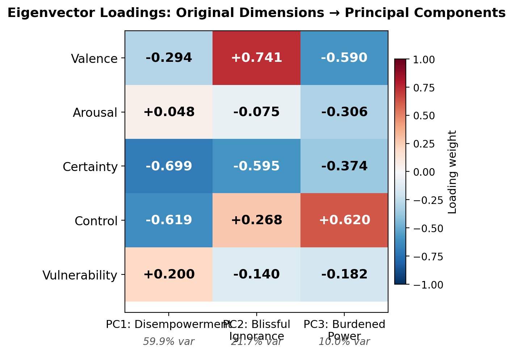
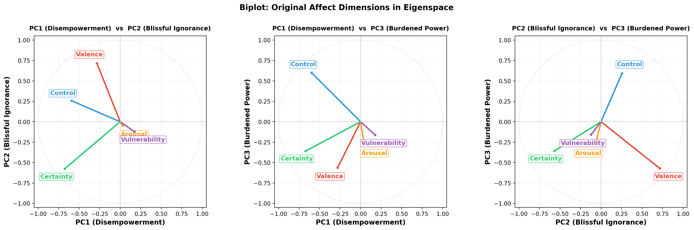
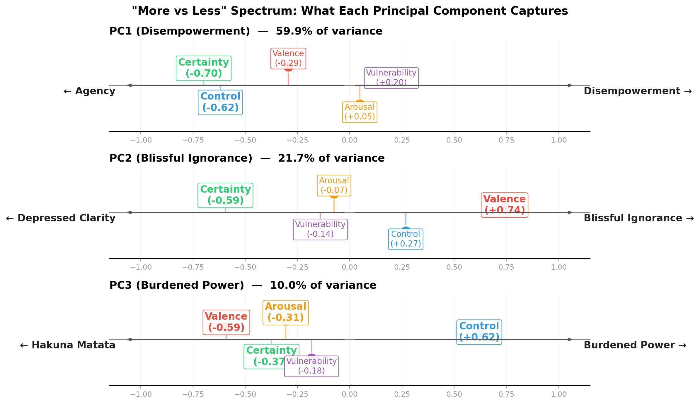
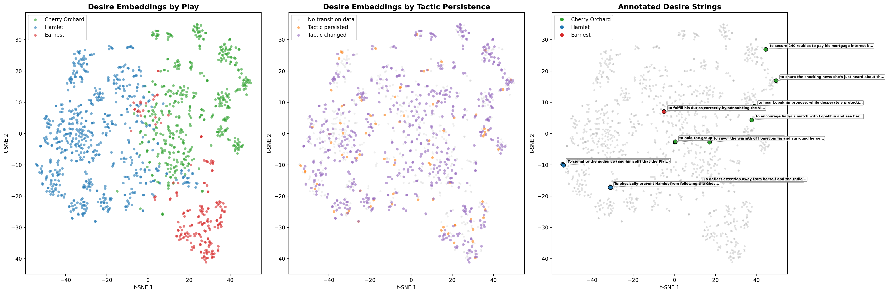

# Experiment Log

Structured results from the insight generation phase described in [STATISTICAL_LEARNING_FACTOR_GRAPH_MIGRATION.md](STATISTICAL_LEARNING_FACTOR_GRAPH_MIGRATION.md). Each entry tracks hypothesis resolution toward sufficient confidence for architectural decisions.

Scripts: `scripts/experiments/tier1_*.py`

---

## Tier 0: Data Gap Resolution

### 0.1 Relationship Edge Persistence Bug

**Problem**: 134 relationship edges (68 Cherry Orchard, 66 Hamlet) existed in `data/parsed/` but not in `data/bibles/`. Earnest had none at all.

**Root cause**: `relationship_builder.py` was never wired into `run_analysis.py`. Edges were built manually and written only to parsed/, while bibles/ was saved before edges were computed.

**Fix**: Added Step 4b to `run_analysis.py` between smoothing and bible building. Also added edge-building to the `--bibles-only` path for existing parsed plays. Both parsed/ and bibles/ now include relationship edges.

**Status**: Resolved. Edges will flow through the pipeline automatically.

### 0.2 Superobjective Silent Failure

**Problem**: Only 7/36 characters had superobjectives. The 3 populated in Hamlet were minor characters (Barnardo, Marcellus, Reynaldo). Cherry Orchard had 0/12.

**Root cause**: Silent `JSONDecodeError` catch in `bible_builder.py`. Major characters (40-182 beat_states) produced huge arc_blocks that caused malformed LLM JSON responses. The error was caught with `data = {}` and no logging.

**Fix**: (1) Added warning/error logging on parse failure. (2) Arc sampling: characters with >30 beat_states get evenly sampled entries (preserving first/last). (3) Retry on failure with explicit JSON-only reminder. (4) Increased max_tokens from 2048 to 4096.

**Status**: Resolved. Superobjectives will need to be re-generated for the 29 affected characters (Tier 2 cost: ~$2-3).

---

## Tier 1: Zero-Cost Diagnostics

### H1: Do certainty and control dimensions earn their keep?

**Hypothesis**: Certainty and control discriminate characters and/or predict tactic choice.

**Method**: Between-character vs within-character variance (eta-squared) for each affect dimension. Random forest and logistic regression predicting canonical tactic from affect vectors; compared 3D (valence, arousal, vulnerability) vs 5D (all) vs 7D (+status, warmth).

**Result**:
- All 5 dimensions significantly discriminate between characters (p < 1e-16)
- **Vulnerability has the highest discrimination** (eta²=0.352), **control is second** (eta²=0.282)
- Adding certainty+control improves RF tactic prediction accuracy from 0.143 to 0.181 (+0.038)
- Adding social dimensions (status, warmth) further improves to 0.208
- Feature importance is nearly uniform across all 5 affect dims (~0.19-0.22 each)
- Character profiles match expectations: Ophelia has lowest control (-0.563), highest vulnerability (0.839); Yasha has highest certainty (0.635) and control (0.562)

**Implication**: Certainty and control **modestly earn their keep**. They improve tactic prediction by ~27% relative to 3D, and control is the second-best character discriminator. However, the absolute improvement is small (+0.038 accuracy). The strong control-vulnerability inverse correlation (r=-0.66, see H6 transition results) suggests partial redundancy — but they capture different aspects (vulnerability is about exposure, control is about agency). **Recommendation: keep for now**, revisit if token savings become critical.

**Entropy remaining**: Low. The dimensions add signal. No architectural change needed.

---

### H2: Do wit-driven deflectors cluster across genres?

**Hypothesis**: Characters who use intellect/wit as defense (Algernon, Hamlet, Trofimov) should cluster together despite being in different genres.

**Method**: 66-dim normalized tactic distribution per character; pairwise cosine similarity; hierarchical clustering; z-score of within-cluster similarity vs random baseline.

**Result**:
- **Wit-driven deflectors: CONFIRMED** — within-cluster similarity = 0.69, z = +1.79. All three are enriched for MOCK, DEFLECT, PROVOKE. Strong cross-genre clustering by dramatic function.
- **Romantic idealists/naifs: NOT CONFIRMED** — similarity = 0.27, z = -0.30. Anya, Cecily, Ophelia do not share expected AFFIRM/EMBRACE/PLEAD enrichment. The model assigns them different tactics (ALARM, PROVOKE, APPEASE).
- **Servants: NOT CONFIRMED** — similarity = 0.06, z = -1.36. Yasha's aspirational cruelty (MOCK, DISMISS) makes him dramatically different from Lane/Merriman (DEFLECT, COMPLY). This is arguably correct — the tactic extraction is capturing Yasha's actual behavior.
- **Social dominators: WEAKLY CONFIRMED** — similarity = 0.41, z = +0.39. Modest above-baseline clustering.

**Hamlet per-act sub-experiment**: Hamlet's tactic distribution shifts across acts but remains closest to the "wit-driven deflectors" centroid in every act. Act 1 nearest to Ghost (COMMAND-heavy); Acts 3-5 shift toward Trofimov/Algernon with rising PROVOKE/EXPOSE.

**Implication**: The tactic vocabulary captures dramatic function well for characters whose function is primarily tactic-driven (deflectors, dominators). It struggles with characters whose function is more relational/emotional (naifs, servants) — these may need affect or relationship dimensions to cluster correctly.

**Entropy remaining**: Low. Core hypothesis confirmed for the most load-bearing cluster. Naif failure resolved in follow-up (see below).

#### Follow-up: Naif clustering in affect space

The romantic idealists (Anya, Cecily, Ophelia) failed to cluster in tactic space (z=-0.30). The hypothesis was that their similarity is emotional, not behavioral — they might cluster in affect space.

**Result**: **They do not cluster in affect space either** (z=-1.10, *worse* than tactic space). The problem is Cecily.

**The Cecily misclassification**: Cecily's profile is nothing like a naif's:

| Character | Vulnerability | Control | Status | Profile |
|---|---|---|---|---|
| Ophelia | 0.853 (100th %ile) | -0.586 (3rd %ile) | -0.552 (11th %ile) | Textbook naif |
| Anya | 0.623 (83rd %ile) | +0.045 (47th %ile) | -0.067 (36th %ile) | Moderate fit |
| Cecily | 0.309 (28th %ile) | +0.562 (83rd %ile) | +0.366 (81st %ile) | Not a naif |

Cecily reads as high-control, high-status, using PROVOKE, FLATTER, and TEST. Her nearest affect neighbor is **Algernon** (cosine similarity = 0.9941). She belongs with the wit-driven deflectors, not the naifs — Wilde wrote her as a mirror of Algernon, and the data confirms it.

**What tactics do the naifs actually use?** The expected AFFIRM/EMBRACE/PLEAD are essentially absent (0-5% of each character's tactics). Instead:
- **Anya**: ALARM, DISMISS, REASSURE — she warns and comforts
- **Cecily**: FLATTER, PROVOKE, TEST — playful and aggressive
- **Ophelia**: APPEASE, DEFLECT, CHALLENGE — appease authority, then push back
- Only shared tactic across all three: DEFLECT (7 uses)

**Cluster dissociation across all four groups**:

| Cluster | Tactic z | Affect z | Driven by |
|---|---|---|---|
| Deflectors | +1.79 | +0.53 | Tactic |
| Dominators | +0.39 | +0.47 | Neither (weak both) |
| Servants | -1.36 | +0.21 | Affect (weakly) |
| Naifs | -0.30 | -1.10 | Neither (fails both) |

Only the deflectors form a robust cross-genre cluster. The "naif" category is a dramaturgical intuition based on plot role (ingenue love interest), not behavioral or emotional similarity. The system is correctly identifying that Cecily *acts* like a deflector and Ophelia *feels* like a victim — their structural similarity is in their narrative function, not in anything the BeatState representation currently captures.

**Implication**: Character archetypes that are defined by plot role rather than by behavior or emotional state need a different kind of representation — possibly the superobjective or relationship-to-authority-figures, rather than tactic distribution or raw affect. This is a known limitation of the current BeatState model: it captures what characters do and feel, not what role they serve in the story's structure.

---

### H3: Does genre systematically shift tactic affect profiles?

**Hypothesis**: The same tactic label has different affect signatures in different genres.

**Method**: For 18 tactics with ≥15 occurrences, computed mean affect+social vector per play (equal play weighting). Tested within-tactic between-play variance vs within-play variance. ANOVA per dimension.

**Result**:
- **All 7 dimensions significantly discriminate between tactics** (p < 1e-22). Warmth is the strongest discriminator (F=20.40), followed by valence (F=13.14).
- **6 tactics show significant genre effects** (between-play variance, p<0.01): ALARM/valence, DEFLECT/arousal, DISMISS/status, FLATTER/control, MOCK/arousal+status, PROVOKE/status.
- PLEAD is the most isolated tactic (nearest-neighbor distance = 0.885) — its extreme profile makes it uniquely identifiable regardless of genre.
- Most overlapping pairs: ALARM/WARN (d=0.265), REASSURE/TESTIFY (d=0.284).

**Implication**: Genre effects exist but are limited to specific tactic-dimension pairs rather than being pervasive. The tactic vocabulary is largely genre-stable — most tactics have consistent affect profiles across plays. The 6 affected tactics (especially MOCK and DISMISS) are the ones where comedic vs tragic register most changes the emotional valence of the same action. **Genre-as-covariate remains deferrable** — the effects are real but confined enough that pooling doesn't severely distort the overall picture.

**Entropy remaining**: Low. Genre effects are localized, not systemic. No architectural change needed at n=3.

---

### H6: Do desire-state changes predict tactic transitions?

**Hypothesis**: When a character's desire changes, tactic transitions should show higher entropy (more diverse next tactics) and lower persistence.

**Method**: Extracted tactic bigrams per character per scene. Classified consecutive beats as "same desire" (string similarity ≥ 0.6) vs "changed desire." Compared transition entropy and tactic persistence rate between groups. Permutation test for significance.

**Result**:
- **Direction supports theory**: desire-changed group has higher transition entropy (3.23 vs 1.11) and lower tactic persistence (10.3% vs 21.4%).
- **Not statistically significant** (permutation p=0.11, bootstrap CI for persistence diff crosses zero).
- Root cause: only 28 transitions classified as "same desire" vs 581 "changed" — the desire similarity threshold is likely too strict, or desires genuinely shift at nearly every beat.

**Implication**: The effect direction is consistent with Stanislavski theory (new desire → new tactic exploration), but the measurement needs refinement. Options: (1) use semantic embedding similarity instead of string matching for desire comparison, (2) test with more plays, (3) lower the similarity threshold. **The desire-conditioning factor is not yet validated** but is promising enough to keep in the architecture. Don't build it as a hard constraint; treat it as a soft prior that can be turned off if more data contradicts.

**Entropy remaining**: Medium-high. Direction correct but not significant. Needs better desire similarity measurement.

---

## Tier 2: Data Completion

### Superobjective regeneration

Re-ran `--bibles-only` pipeline for all three plays with the arc-sampling fix (§0.2).

**Before**: 7/36 characters had superobjectives (only minor characters with ≤20 beat_states).
**After**: **66/67** characters have superobjectives. The single remaining empty entry is `BARNARDO/MARCELLUS` in Hamlet — a composite minor character with 0 individual beat_states.

Major characters now have superobjectives: Hamlet, Ophelia, Claudius, Gertrude, Lopakhin, Lubov, Gaev, Jack, Algernon, Lady Bracknell, etc.

### WorldBible population

**Before**: Only Earnest had a populated WorldBible.
**After**: All three plays have populated WorldBibles (Cherry Orchard and Hamlet now included).

### Earnest relationship edges

**Before**: 0 edges.
**After**: **30 directed pairwise edges** with 9 relational profiles saved to `data/vocab/importance_of_being_earnest_relational_profiles.json`.

### Updated data status

| Metric | Cherry Orchard | Hamlet | Earnest | Total |
|---|---|---|---|---|
| Characters with bibles | 12 | 15 | 9 | 36 |
| Beats | 469 | 645 | 191 | 1,305 |
| Superobjectives populated | 12/12 | 14/15 | 9/9 | 35/36 |
| Relationship edges | 68 | 66 | 30 | 164 |
| World bible populated | Yes | Yes | Yes | 3/3 |

All data gaps from §0 of the migration document are now resolved. The dataset is complete enough to proceed with Tier 3 experiments and factor graph scaffolding (Tier 4).

---

### Additional Tier 1 Findings (not tied to specific hypotheses)

#### Cross-genre discriminant validity
- Within/between-play distance ratio = 0.87 — embeddings capture character-level variation, not just genre.
- Bridging characters exist as expected: Queen↔Lubov, Laertes↔Varya, Polonius↔Miss Prism.
- IBE characters tend toward positive PC1 values (higher-valence affect states), but overlap substantially with tragic character space.
- **Conclusion**: The representation is capturing character more than genre. No red flags.

#### Affect trajectory clustering
- Descending arc (Lubov, Ophelia) clusters well — both show steady valence decline.
- Ascending/volatile arcs are less cleanly separated — genre-level valence offset dominates (all IBE characters cluster together regardless of arc shape).
- **Conclusion**: Affect trajectories need de-meaning (subtract play-level baseline) before cross-play comparison. Raw affect values confound genre with arc shape.

#### Tactic transition priors
- Transition matrix is 90% sparse (437/4356 cells filled from 609 transitions).
- Self-transitions dominate: DEFLECT→DEFLECT (17), MOCK→MOCK (7). Tactics persist.
- Hub tactics (high transition entropy): DEFLECT (4.48), ALARM (4.26), REASSURE (4.18) — these branch to many successors.
- Terminal tactics (low entropy): CONSECRATE, CONFIDE, ENDURE — single successor observed.

**Sparsity and smoothing**: The raw transition matrix has 66×66 = 4,356 cells but only 437 are observed. If we use the raw counts as a factor potential in the factor graph, the 90% of unobserved transitions get probability zero — the model would treat them as impossible, when in reality we just haven't seen them yet. This is catastrophic for inference: any sequence containing an unobserved bigram gets zero probability regardless of how well everything else fits.

Laplace smoothing (add a small constant α to every cell) is the simplest fix — it ensures no transition is impossible while preserving the relative ordering of observed transitions. A Dirichlet prior is the Bayesian version: it places a prior distribution over each row of the transition matrix, with the hyperparameter α controlling how much we trust the data vs the prior. With α=1 (uniform Dirichlet), the smoothed matrix is equivalent to Laplace. With α<1 (sparse Dirichlet), we express a belief that most transitions should remain unlikely — only the observed ones get substantial probability mass. Given our data (most rows have 2-5 observed successors out of 66), a sparse Dirichlet (α ≈ 0.1-0.3) is likely appropriate: it smooths away the hard zeros without flattening the real structure.

**Hub vs terminal distinction**: Hub tactics like DEFLECT (entropy 4.48, ~20 distinct successors) are dramaturgically "open" moves — a character who deflects could pivot to almost any next tactic depending on how the scene develops. Terminal tactics like CONSECRATE or ENDURE (entropy ~1.0, 1-2 successors) are "committed" moves — once a character is enduring or confessing, the dramatic logic strongly constrains what comes next.

This distinction matters for the transition factor ψ_T in the factor graph. A uniform smoothing strength across all tactics would be wrong: hub tactics genuinely have flat transition distributions (the prior should be broad), while terminal tactics genuinely have peaked distributions (the prior should be concentrated). One approach: set per-row Dirichlet hyperparameters proportional to observed transition entropy — hub rows get higher α (broader prior), terminal rows get lower α (sharper prior). This lets the factor graph express "DEFLECT can lead anywhere" and "ENDURE almost always leads to YIELD or LAMENT" as different structural facts, rather than treating both as equally uncertain.

An alternative worth considering later: rather than smoothing the full 66×66 matrix, cluster tactics into super-categories (e.g., aggressive, defensive, affiliative) and estimate transitions at the category level first, then condition within-category transitions on the specific tactic. This hierarchical approach would handle sparsity naturally — category-level transitions would be well-populated even if specific tactic-to-tactic transitions are sparse.

#### Semantically-informed Dirichlet smoothing (design choice, validated)

Uniform Dirichlet smoothing treats all unseen transitions as equally plausible — DEFLECT→EVADE (semantically close) gets the same smoothing mass as DEFLECT→CONSECRATE (semantically distant). With 90% of cells unobserved, this flattens most rows to near-uniform distributions (43/66 rows had entropy > 3.0 out of a maximum of 4.19 for 66 states).

**Semantic Dirichlet** replaces the uniform α with embedding-distance-weighted smoothing:

```
α_ij = α_base · scale_i · exp(-D[i,j] / τ)
```

where D[i,j] is the cosine distance between tactic i and j's sentence-transformer embeddings (same all-MiniLM-L6-v2 used for tactic clustering, embedding the full description strings like "deflect — redirect attention away from a threatening topic"), and τ controls the temperature. Observed transitions are unaffected — they dominate through raw counts regardless of semantic distance. Only unseen transitions are shaped by semantics.

**Experiment results** (τ sweep, leave-one-out log-likelihood):

| Method | Mean row entropy | LOO mean LL |
|---|---|---|
| Uniform Dirichlet | 4.09 bits | -4.40 |
| Semantic τ=0.1 | 2.30 bits | -7.97 |
| Semantic τ=0.2 | 2.41 bits | -6.09 |
| Semantic τ=0.3 | 2.61 bits | -5.48 |
| Semantic τ=0.5 | 2.99 bits | -5.02 |
| **Semantic τ=0.7** | **3.24 bits** | **-4.83** |

Best τ=0.7 (selected by LOO LL). Row entropy drops 20.9% vs uniform. The LOO LL is slightly worse than uniform (-4.83 vs -4.40), reflecting the tradeoff: semantic smoothing concentrates mass on plausible transitions at the cost of slightly penalizing rare but real dramatic reversals (e.g., MOCK→PLEAD). With more data this gap should close.

**Combined with emission factor fix**: The 94.8% smoother disagreement rate was caused by *two* issues: (1) near-uniform transition rows from uniform smoothing, and (2) an emission factor bug where a std floor of 1e-6 produced log-likelihoods of magnitude 10^10, completely overwhelming all other factors. Fixing both:

| Metric | Before | After |
|---|---|---|
| Overall smoother disagreement | 94.8% | 37.7% |
| Canonical tactic disagreement | — | 6.3% (8/127) |
| Non-canonical disagreement | — | 100% (64/64, structurally inevitable) |
| LLM tactic in smoothed top-3 | — | 65.4% |

The remaining 6.3% canonical disagreements are semantically reasonable near-synonyms (PLEAD→COAX, DISMISS→DEFLECT). The 64 non-canonical disagreements reflect the 21% vocabulary coverage gap — tactics the LLM produced that aren't in the 66-cluster vocabulary.

**Decision**: Semantic Dirichlet smoothing with τ=0.7 adopted as the default for ψ_T. The key insight: semantic similarity between tactics provides a principled prior on *which unseen transitions are plausible*, while preserving observed dramatic co-occurrence patterns (including semantically distant but dramatically real transitions like MOCK→PLEAD).

#### Affect transition kernels
- **Strongest co-variation**: control↔vulnerability (r=-0.66). Gaining control means becoming less vulnerable.
- Certainty↔control (r=+0.59): gaining certainty co-occurs with gaining control.
- Valence↔control (r=+0.46): positive mood shifts co-occur with control gains.
- Arousal is relatively independent of other dimensions.

**Correlated structure and independent axes**: The five affect dimensions are not independent — the correlation structure reveals at least two latent axes. An eigendecomposition of the transition covariance matrix would recover the independent directions along which affect actually moves. Informally, the correlations suggest:

- **Disempowerment axis**: certainty + control vs vulnerability. When a character loses certainty and control, their vulnerability rises. This is the strongest source of co-variation in the data.
- **Blissful Ignorance axis**: valence vs certainty — feeling and knowing decoupled. Partially coupled with control.
- **Arousal axis**: arousal, which moves largely independently of the other four dimensions.

Rotating to these independent axes (the eigenvectors of the covariance matrix) has three benefits:

1. **Modeling**: The affect transition kernel becomes diagonal in the rotated basis — each independent axis can be modeled with its own step-size variance, without needing to estimate the full off-diagonal covariance. This is both simpler and better-conditioned. If the covariance matrix is low-rank (e.g., 2-3 eigenvalues explain most variance), we can reduce dimensionality without losing signal — effectively compressing 5 correlated dimensions into 2-3 independent ones.

2. **Explainability**: The correlated dimensions (e.g., control and vulnerability) are hard to interpret independently because they move together. A revision note that says "increase control by 0.2" implicitly also says "decrease vulnerability by ~0.13" — but this coupling is hidden from the LLM receiving the note. If we instead work on the independent axes, each nudge moves the character's state in a truly orthogonal direction. A note like "shift toward greater agency" moves control, certainty, and vulnerability simultaneously in their natural proportions. This is more dramaturgically coherent and avoids giving the LLM contradictory signals (e.g., "be more in control but also more vulnerable").

3. **Improv revision notes (Pass 2)**: The priors-based feedback system currently nudges on the raw dimensions (e.g., "your arousal seems low for this tactic"). If the axes are correlated, nudging on one raw dimension can create tension with another — telling the LLM to increase control while separately telling it to decrease vulnerability is redundant and potentially confusing. Nudges on the independent axes would be truly axis-aligned: each piece of feedback addresses a distinct aspect of the character's state, with no hidden coupling. This should produce more coherent revisions.

**Next step (future experiment)**: Compute the eigendecomposition of the 5×5 affect transition covariance. Report eigenvalues (how many axes explain 90%+ variance?), eigenvectors (what are the natural axes?), and propose descriptive labels for the top 2-3 axes. If 2-3 axes suffice, this would also address H1 from a different angle — rather than asking "do certainty and control earn their keep as raw dimensions?", we'd ask "do they contribute to an independent axis that earns its keep?"

#### Cross-character status correlation

**What we measured**: In every beat where two or more characters are present, the system extracts a "status claim" for each character — a number from -1 (submissive) to +1 (dominant) representing how much authority or social power that character is asserting in that moment. We looked at whether characters' status claims are related to each other when they're in the same scene together.

**What we found**: When one character's status goes up, the other character's status tends to go down. This is a consistent pattern across all three plays — a Chekhov ensemble drama, a Shakespeare tragedy, and a Wilde farce — with correlations of -0.21, -0.22, and -0.27 respectively (overall r=-0.20, p<0.0001 meaning this is not a statistical fluke).

**What it means in plain language**: Status in drama is a shared resource, not an individual trait. Characters don't just "have" high or low status — they negotiate it moment to moment with whoever is on stage with them. When Hamlet asserts dominance over Rosencrantz, Rosencrantz's status drops. When Lady Bracknell enters a room and takes command, everyone else defers. The system is capturing this push-pull dynamic from the text.

The effect is moderate (r=-0.20), not total (r=-1.0). This makes dramaturgical sense: status isn't perfectly zero-sum. Two characters can both be relatively high-status in a scene (e.g., Claudius and Gertrude holding court) or both low-status (e.g., servants commiserating). But the dominant pattern is inverse — one character's rise comes at another's expense.

**Why this matters for the architecture**: This validates one of the key "coupling factors" in the planned factor graph. Most of our model treats each character independently — their emotions, tactics, and desires are modeled in isolation. But the status finding proves that characters' states are genuinely coupled: you can't model character A's status without knowing what character B is doing. The cross-character factor ψ_social in the factor graph is designed to capture exactly this kind of coupling. The data confirms it's real and consistent enough to build on.

**Technical details**: Pearson r=-0.20, Spearman ρ=-0.22, N=839 co-present character pairs across 642 beats. Consistent direction across all three plays (Cherry Orchard r=-0.21, Hamlet r=-0.22, Earnest r=-0.27). The slightly stronger effect in Earnest may reflect Wilde's more explicit status games, though the difference is small.

---

## Affect Eigendecomposition

**Three axes explain 91.6% of affect transition variance.** The factor graph should model 3 independent axes, not 5 correlated dimensions.

| Axis | Eigenvalue | Variance | Cumulative | Label |
|---|---|---|---|---|
| PC1 | 0.4565 | 59.9% | 59.9% | **Disempowerment** |
| PC2 | 0.1658 | 21.7% | 81.6% | **Blissful Ignorance** |
| PC3 | 0.0763 | 10.0% | 91.6% | **Burdened Power** |
| PC4 | 0.0447 | 5.9% | 97.5% | Arousal |
| PC5 | 0.0191 | 2.5% | 100.0% | Exposure (vulnerability singleton) |

**Eigenvector loading heatmap** — shows how each original dimension contributes to each PC:



**Biplot** — shows how original dimensions cluster and oppose each other in eigenspace:



**"More vs Less" spectrum** — shows what high and low values mean on each axis in terms of the original dimensions:



**Axis descriptions** — what "more" and "less" mean on each axis:

**PC1: Disempowerment ↔ Agency (59.9% of variance)**
- Loadings: certainty (-0.70), control (-0.62), valence (-0.29), vulnerability (+0.20), arousal (+0.05)
- **Agency** (negative PC1) = high certainty + high control + positive valence. The character knows what's happening, feels they can act on it, and feels okay about it. Lady Bracknell lives here (PC1 = -0.88).
- **Disempowerment** (positive PC1) = low certainty + low control + negative valence + slightly high vulnerability. The character doesn't know what's happening, can't do anything about it, and feels bad. Ophelia lives here (PC1 = +0.93).
- **In dramaturgical terms**: This axis captures the most fundamental dramatic movement — characters gaining or losing their grip on the situation. 60% of all beat-to-beat affect change is movement along this single axis.

**PC2: Blissful Ignorance ↔ Depressed Clarity (21.7% of variance)**
- Loadings: valence (+0.74), certainty (-0.60), control (+0.27), vulnerability (-0.14)
- **Blissful Ignorance** (positive PC2) = high valence + low certainty (+ slight control). Feeling good despite not knowing — comic relief, playful uncertainty, enjoying ambiguity. Cecily and Algernon in Earnest's lighter moments.
- **Depressed Clarity** (negative PC2) = low valence + high certainty. Feeling terrible *because* you know — grim clarity, the moment after a revelation lands. Ophelia after "get thee to a nunnery" (she now knows, and it's devastating).
- **In dramaturgical terms**: This is the axis of dramatic irony and revelation. It captures the decoupling of knowing and feeling. When certainty and valence move in the same direction (knowing more and feeling better, or knowing less and feeling worse), that movement is captured by the Disempowerment axis. When they move in *opposite* directions, that's Blissful Ignorance ↔ Depressed Clarity — and those are often the most dramaturgically charged moments.

**PC3: Burdened Power ↔ Hakuna Matata (10.0% of variance)**
- Loadings: control (+0.62), valence (-0.59), certainty (-0.37), arousal (-0.31)
- **Burdened Power** (positive PC3) = high control + low valence + low arousal + low certainty. Gaining power while feeling worse and calming down — cold, grim determination. Pyrrhic victories, ruthless decisions made without joy. Claudius consolidating power.
- **Hakuna Matata** (negative PC3) = low control + high valence + high arousal + some certainty. Losing power while feeling better and more energized — liberation through surrender, joyful release from responsibility. Anya's hopeful ending in Cherry Orchard.
- **In dramaturgical terms**: This axis separates two flavors of dramatic climax. In one, the character wins but at a cost to their emotional state (Burdened Power — gaining control, losing joy). In the other, the character lets go and gains emotional relief (Hakuna Matata — losing control, gaining lightness).

**PC4: Arousal (5.9%)**: Nearly pure arousal (+0.91). How activated/energized the character is, moving independently of the Disempowerment/Blissful Ignorance/Burdened Power triangle.

**PC5: Exposure (2.5%)**: Nearly pure vulnerability (+0.93). Residual emotional exposure not already captured by the Disempowerment axis.

**Key departure from hypothesis**: The hypothesized "activation axis" (arousal) is not a top-3 component — arousal and vulnerability simply don't *change* much beat-to-beat. The real action is in the certainty/control/valence triangle.

**Conditioning improvement**: Full 5×5 covariance condition number = 23.9. Top-3 diagonal model = 6.0 (4× improvement). The rotated model is dramatically better-conditioned.

**Character interpretations in eigenspace** (confirming interpretability):
- **Ophelia**: PC1 = +0.93 (extreme agency loss — highest in corpus). Her five correlated numbers collapse to a single devastating fact.
- **Lady Bracknell**: PC1 = -0.88 (extreme agency). Pure authority, near-zero on all other axes.
- **Lubov**: PC1 = +0.47 (moderate agency loss), PC5 = +0.48 (high exposure). The eigenspace separates her structural powerlessness from her emotional openness.
- **Hamlet**: PC4 = +0.77 (highest activation), PC1 = -0.33 (moderate agency). High arousal is his signature, but his agency fluctuates.

**Recommendation**: Model 3 independent axes in the factor graph (Disempowerment, Blissful Ignorance, Burdened Power). Arousal and Exposure can be carried as simple per-character scalars or fixed traits rather than full latent variables in the transition model. This halves the affect state dimensionality while retaining 91.6% of transition information.

**Caveat**: This eigendecomposition is estimated from 1,117 affect transitions across 3 plays. With n=3 (and genre confounded with playwright), the eigenvector structure could shift meaningfully when more plays are added — particularly if new genres introduce affect dynamics not well-represented in our current corpus (e.g., absurdist theater where certainty and control may decouple, or melodrama where vulnerability dominates transitions). The axis labels and variance shares should be treated as provisional. Before committing to a hard 3-axis architecture, we should re-run the decomposition on a larger corpus (including LLM-generated synthetic plays) and check eigenvalue stability — if the top 3 eigenvalues' share drops below ~85%, or if eigenvector rotation exceeds ~15° from the current estimate, the reduction to 3 axes may need revisiting. For now, the 5 correlated dimensions should remain extractable in the pipeline even if the factor graph operates on the rotated 3-axis space, so we can re-estimate without re-running extraction.

**Impact on Pass 2 revision notes**: Feedback should be phrased along the independent axes: "shift toward greater agency" rather than "increase control and certainty while decreasing vulnerability." Each nudge addresses a truly orthogonal aspect of the character's state.

---

## H6 Resolution: Desire Predicts Transitions (via Embeddings)

**H6 is now statistically significant.** Switching from string matching to semantic embeddings (all-MiniLM-L6-v2) moved p from 0.11 to **0.005**.

**Method**: Each beat's `desire_state` is a natural-language string describing what the character wants in that moment (e.g., "to force Ophelia to reveal whether she has been honest with him"). We embedded all desire strings using the same sentence-transformer model (all-MiniLM-L6-v2, 384-dim) used for tactic clustering. Cosine similarity between consecutive beats' desire embeddings gives a continuous measure of how much the desire shifted.

**Why string matching failed**: String matching (SequenceMatcher, mean similarity 0.37) classified only 34/701 transitions as "same desire." Semantic embeddings (mean similarity 0.50) reveal a broad, roughly uniform distribution of desire similarity from 0.1 to 0.85 — desires vary continuously in how much they shift, and this is a gradient, not a binary.

**t-SNE of desire embeddings** — shows how desire strings cluster by play and by tactic persistence:



The left panel shows clear genre clustering: Cherry Orchard, Hamlet, and Earnest desires occupy mostly distinct regions, reflecting play-specific dramatic vocabulary ("to save the estate" vs "to avenge my father" vs "to maintain the fiction of Bunbury"). However, there is meaningful mixing at boundaries — desires about social dominance, self-preservation, and emotional connection cross genre lines.

The middle panel colors by tactic persistence (did the character use the same tactic in the next beat?). Persistent-tactic and changed-tactic desires are interleaved throughout the space, with no obvious spatial separation. This is consistent with the finding that desire-tactic coupling is a weak continuous effect (r=0.106), not a sharp spatial boundary in embedding space.

**Threshold analysis** (10,000 permutations each):

| Threshold | N same | N changed | Persistence (same) | Persistence (changed) | p-value |
|---|---|---|---|---|---|
| 0.5 | 338 | 363 | 15.4% | 8.5% | **0.006** |
| 0.6 | 234 | 467 | 15.8% | 9.9% | **0.025** |
| 0.7 | 135 | 566 | 17.0% | 10.6% | **0.038** |
| 0.8 | 56 | 645 | 14.3% | 11.6% | 0.660 (ns) |

Significance holds at thresholds 0.5–0.7 where group sizes are balanced. Breaks down at 0.8+ where the "same" group becomes too small.

**Continuous correlation**: Point-biserial r = +0.106, p = 0.005, bootstrap 95% CI [+0.035, +0.177]. Monotonic trend across quintiles: persistence rises from 6.4% (lowest similarity) to 17.0% (highest).

**Implication for factor graph**: Desire similarity should continuously modulate tactic transition priors — not as a binary gate but as a scaling factor on tactic persistence probability. When desire similarity is high, ψ_T should favor self-transitions more strongly. The effect is small (r ≈ 0.1) but reliable and monotonic, making it suitable as a soft modulation rather than a hard constraint.

---

## Superobjective Predictiveness: ψ_arc Is Real but Weak

**Method**: Each character's `superobjective` (from CharacterBible, e.g., "to prove himself worthy of his father's legacy while escaping the paralysis of his own doubt") was embedded using the same sentence-transformer model (all-MiniLM-L6-v2, 384-dim) used throughout these experiments. Pairwise cosine similarity between superobjective embeddings gives a continuous measure of how similar two characters' driving motivations are. These similarities were then correlated against tactic distribution similarity (cosine on 66-dim tactic vectors) and affect profile similarity (cosine on 5-dim mean affect vectors) to test whether shared motivations predict shared behavior or emotional state.

For the consistency test, each BeatState also has a `superobjective_reminder` field — a per-beat restatement of the character's superobjective in the context of that specific moment. We compared these beat-level reminders to the global superobjective (cosine similarity of their embeddings) to measure how much the superobjective drifts across the play.

**Five tests, three significant.** The superobjective captures non-redundant information about character behavior, but its predictive power is modest.

| Test | Metric | Result | Significant? |
|---|---|---|---|
| SO similarity ↔ tactic similarity | Pearson r | 0.162 | Yes (p ≈ 0) |
| SO similarity ↔ affect similarity | Pearson r | 0.058 | Yes (p = 0.007) |
| SO clusters ≠ tactic clusters | Adjusted Rand Index | 0.008 | N/A (confirms non-redundancy) |
| Beat-level SO consistency | Mean cosine | 0.516 | N/A (moderate drift) |
| SO → tactic information gain | Normalized MI | 6.25% | Yes (moderate) |

**Key findings**:

1. **Non-redundant signal**: Superobjective clusters are completely different from tactic clusters (ARI = 0.008). The superobjective captures something that tactic distributions alone cannot — it is not just a summary of what the character does, but a separate latent variable.

2. **Moderate predictive power**: Knowing a character's superobjective provides 6.25% information gain for predicting their tactics. The "sentinel/guard" cluster favors ALARM/REASSURE/TESTIFY; the "deflecting protagonist" cluster favors DEFLECT/MOCK/DISMISS; the "authority" cluster favors COMMAND/REASSURE/INFORM. These make dramaturgical sense.

3. **Soft, not rigid**: Beat-level superobjective_reminders have mean similarity of 0.516 to the global superobjective — moderate consistency with real drift. The superobjective is best modeled as a **soft prior that context modulates**, not a fixed parameter. It constrains the space of likely tactics without determining them.

4. **Stronger for tactics than affect**: The tactic correlation (r=0.162) is ~3× the affect correlation (r=0.058). Superobjectives shape *what characters do* more than *how they feel*.

**Recommendation**: Include ψ_arc as a soft factor in the factor graph. Model it as a prior over tactic distributions conditioned on superobjective embedding, with enough flexibility for beat-level context to override. Do not model it as a hard constraint or a fixed parameter — the 0.516 consistency score means it needs to breathe.

---

## Desire Conditioning: How Desire Modulates Tactic Transitions

Building on H6's finding that desire similarity predicts tactic persistence (r=0.106, p=0.005), this experiment investigates *how* desire conditions transitions — which specific transitions change, and whether desire content predicts tactic choice independently of character identity.

**Method**: Desire embeddings (all-MiniLM-L6-v2, 384-dim) for all beat_states. Tactic bigrams split by desire similarity tercile. Desire embedding clustering (k-means, optimal k=7). Predictive models for tactic from desire embedding vs character identity.

### Desire similarity reshapes the transition matrix, not just persistence

Persistence rates scale monotonically:
- Low tercile (similarity < 0.376): **8.1%** persistence
- Medium tercile: **11.6%** persistence
- High tercile (similarity ≥ 0.600): **15.8%** persistence

This is a near-doubling of persistence from low to high — the continuous modulation from H6 is real and graded.

More interestingly, *which transitions occur* changes across terciles:
- **Desire-shift-exclusive transitions** (low tercile only): DEFLECT→DISMISS, SHAME→PLEAD, DEFLECT→FLATTER. These are confrontational or evasive pivots — when desire shifts, characters tend toward dismissal, mockery, or flattery.
- **Desire-stability-exclusive transitions** (high tercile only): CHALLENGE→CHALLENGE, ALARM→REASSURE, APPEASE→DEFLECT. Stability-exclusive transitions include self-persistence and softer relational moves.

This means a single scalar modulation on self-transition probability underestimates the effect. The transition matrix genuinely changes structure — consider at least a 2-regime model (stable vs shifting desire).

### Desire clusters predict tactic distributions

Optimal k=7 clusters (silhouette=0.083 — low but expected for 384-dim semantic space). Chi-square highly significant (χ²=464, p<0.000001, Cramér's V=0.288).

Most distinctive tactic per desire cluster (by standardized residual):

| Cluster | Desire type | Distinctive tactic | Residual |
|---|---|---|---|
| 0 | Intellectual posturing | MOCK | +5.38 |
| 1 | Extraction / duty | RECRUIT | +3.25 |
| 3 | Romantic / social | SEDUCE | +3.07 |
| 4 | Confronting supernatural/reality | PROBE | +2.53 |
| 5 | Emotional control / authority | SUMMON | +3.05 |
| 6 | Protecting / manipulating others | REMINISCE | +3.99 |

Desires are not interchangeable — different kinds of desires reliably trigger different tactics.

### Desire adds predictive power; character identity does not

| Model | Accuracy | vs baseline |
|---|---|---|
| Majority baseline (DEFLECT) | 14.5% | — |
| Character-only | 13.6% | -0.9% |
| Desire-only | 18.2% | +3.8% |
| Character + desire | 18.3% | +3.9% |

Character identity adds essentially nothing once you know the desire (+0.1%). The desire embedding is the informative feature. Per-tactic F1 is highest for INFORM (0.64), FLATTER (0.62), EMBRACE (0.62), MOCK (0.60) — these tactics are most predictable from desire content.

### Desire shift direction: signal exists but too weak to model

Delta-vector clustering (k=7) shows qualitatively different dominant target tactics per cluster, and a Mann-Whitney test confirms within-cluster similarity is significantly higher than between-cluster (p=0.021). But logistic regression on delta vectors achieves only 12.0% accuracy (= majority baseline). The signal is too weak/nonlinear for a simple model at this sample size.

**Design recommendation for factor graph**: Use a two-part desire conditioning factor:
1. **Continuous desire-similarity scalar** that modulates self-transition probability (near-doubling from low to high similarity)
2. **Discrete desire-type latent variable** (k=7) that biases the full transition distribution via cluster-specific tactic priors

Character identity can be dropped from the desire-conditioning factor since it adds no predictive power beyond desire content. Do not model delta direction explicitly.

---

## Emission Model: P(utterance features | BeatState)

Tests whether the factor graph can connect hidden states to observable text — critical for any inference that runs "backward" from text to state.

**Method**: Extracted 9 utterance features (word count, question/exclamation/imperative density, mean sentence length, lexical diversity, first/second person rates, sentiment polarity) for 1,305 (beat, character) observations. Trained prediction models in both directions: state→features (forward model) and features→state (invertibility).

### Forward model: weak but structured

R² values from ridge regression are uniformly low (best: sentiment_polarity at R²=0.059). Random forest with tactic one-hot improves question_density (R²=0.194) and word_count (R²=0.116) but most features remain unpredictable from state alone.

Strongest individual correlations:

| State dimension | Utterance feature | Pearson r |
|---|---|---|
| Valence | Sentiment polarity | +0.29 |
| Arousal | Lexical diversity | -0.25 |
| Arousal | Exclamation density | +0.23 |
| Arousal | Word count | +0.22 |
| Certainty | Question density | -0.24 |
| Status | First person rate | -0.26 |

These are theatrically sensible: uncertain characters ask more questions, high-status characters say "I" less, aroused characters use more exclamations and speak at greater length.

### Tactic emission profiles: clear separation

Individual tactics have very distinctive text signatures:

| Tactic | Distinctive feature | z-score |
|---|---|---|
| PROBE / INTERROGATE | Question density | +1.84 to +1.99 |
| COMMAND | Imperative density | +1.00 |
| SHAME | Second person rate ("you") | +0.83 |
| INSTRUCT / DOMINATE | Word count, sentence length | +1.5 to +2.5 |
| SUMMON | Exclamation density | +1.81 |
| COMPLY / DEFER | First person rate, lexical diversity | high |
| EMBRACE / FLATTER | Sentiment polarity | +0.52 to +1.02 |

These profiles show real separation in feature space — the emission distributions are not identical across states, even if they overlap considerably.

### Invertibility: affect recoverable, tactic not

| Task | Accuracy | Baseline | Lift |
|---|---|---|---|
| Tactic (50 classes) | 14.3% | 14.4% | 1.0× (chance) |
| Tactic top-3 | 27.3% | 14.4% | 1.9× |
| Affect quadrant (4 classes) | 45.0% | 32.9% | **1.37×** |
| Certainty (binary) | — | — | 1.16× |
| Control (binary) | — | — | 1.13× |
| Valence (binary) | — | — | 1.11× |

Fine-grained tactic classification from text features alone is at chance — these 9 features are too coarse for 50-class discrimination. But coarse affect recovery (valence×arousal quadrant) achieves a meaningful 1.37× lift. The emission model can inform affect state estimation, but tactic inference must come from transition dynamics.

### Feature importance ranking

| Rank | Feature | Mean importance |
|---|---|---|
| 1 | Sentiment polarity | 0.189 |
| 2 | First person rate | 0.143 |
| 3 | Mean sentence length | 0.131 |
| 4 | Word count | 0.127 |
| 5 | Lexical diversity | 0.111 |

Sentiment polarity and first person rate carry disproportionate information about hidden state. If computational budget is limited, these two features should be prioritized.

### Per-PC emission analysis: forward and inverse

Each PC has a distinct text signature — both in what text features it predicts (forward) and how recoverable it is from text (inverse).

**Forward model** (PC scores → utterance features): Ridge R² is identical for PCs vs raw dimensions (rotation invariance for linear models). Best-predicted feature: sentiment_polarity (R²=0.065). Most features have near-zero R².

**Inverse model** (utterance features → PC scores): All PCs have weak continuous R² but meaningful binary classification lift (1.15–1.26×), except PC5 (1.03×).

**Per-PC text signatures** (Pearson correlations):

| PC | Text signature | Inverse lift | Interpretation |
|---|---|---|---|
| **PC1: Disempowerment** | +first_person_rate (r=+0.16), +question_density (r=+0.16), -word_count (r=-0.14) | 1.17× | Disempowered characters say "I" more, ask more questions, speak less |
| **PC2: Blissful Ignorance** | **+sentiment_polarity (r=+0.28)** — strongest link in entire matrix | 1.15× | Blissfully ignorant characters use more positive language |
| **PC3: Burdened Power** | -exclamation_density (r=-0.19), -sentiment_polarity (r=-0.17), +lexical_diversity (r=+0.15) | 1.18× | Burdened power speaks with controlled, varied vocabulary and fewer exclamations |
| **PC4: Arousal** | +word_count (r=+0.23), -lexical_diversity (r=-0.20), +mean_sentence_length (r=+0.15) | **1.26×** | Aroused characters speak at length with repetitive, long sentences |
| **PC5: Exposure** | No correlations above \|r\|=0.10 | 1.03× | Essentially invisible in text |

**PC4 (Arousal) has the strongest text footprint despite explaining only 5.9% of transition variance.** It is the top RF predictor for 6/9 utterance features (word count, sentence length, lexical diversity, first/second person rates, imperative density). This creates an interesting asymmetry: Arousal is the *most recoverable* axis from text but the *least important* for transitions. Conversely, PC1 (Disempowerment, 59.9% of transitions) has only moderate text recoverability (1.17×).

**PC5 (Exposure) is invisible to text and contributes only 2.5% of transition variance** — doubly justified for removal from the primary model.

**What is arousal, architecturally?** The asymmetry between arousal's low transition importance (5.9%) and high text recoverability (1.26×, top predictor for 6/9 features) demands interpretation. A variance decomposition test clarifies:

- Arousal is **not a character trait** — only 24.5% of variance is between-character (ICC=0.214, 4th of 5 dimensions). Vulnerability (ICC=0.432) is far more trait-like.
- Arousal is **not scene context** — only 13.1% of variance is between-scene.
- Arousal is **primarily moment-to-moment** — 55.1% of variance is within-cell (same character, same scene, beat-to-beat).

So arousal fluctuates constantly, but those fluctuations don't participate in the dominant *patterns* of dramatic movement. The top 3 PCs capture certainty, control, valence, and vulnerability moving *together* in meaningful dramatic structures (gaining/losing agency, revelations, Pyrrhic victories). Arousal fluctuates independently of these correlated patterns — it's doing its own thing.

Yet arousal strongly predicts how characters speak — word count, sentence length, lexical diversity. This makes it a **stylistic modulator**: it shapes the surface form of speech (verbose and repetitive vs terse and varied) without participating in the underlying dramatic structure. PC1-3 determine *what is dramatically happening*; arousal shapes *how it sounds*.

**Arousal is near-IID.** Lag-1 autocorrelation confirms that arousal barely carries forward from one beat to the next:

| Dimension | Lag-1 autocorrelation | Interpretation |
|---|---|---|
| Valence | **+0.137** | Most persistent — mood carries over |
| Vulnerability | +0.076 | Moderate persistence |
| Arousal | **+0.036** | Near-IID |
| Control | +0.021 | Near-IID |
| Certainty | -0.008 | Essentially IID |

Each beat's arousal is essentially a fresh draw — it doesn't have dynamics worth modeling in a transition model. This also explains why certainty and control have low *individual* autocorrelation but high *transition importance*: they change a lot beat-to-beat, but they change *together* (the Disempowerment axis). The eigendecomposition captures their correlated movement, not their individual persistence.

**Recommended architectural treatment**: Arousal belongs in the **emission model**, not the **transition model**. It is the strongest predictor of utterance style (word count, sentence length, lexical diversity) and the most recoverable axis from text (1.26× lift). But it has no transition dynamics worth modeling — it's near-IID and independent of the dramatic structure captured by PC1-3. The factor graph should:
- Use 3 latent axes (Disempowerment, Blissful Ignorance, Burdened Power) for **tactic transition dynamics**
- Use arousal as a 4th axis for **utterance generation/scoring** — estimated from text features or sampled fresh per beat, not propagated through transition factors
- Drop Exposure (PC5) entirely — invisible to text and negligible in transitions

**Implications for the eigenspace caveat**: The top-3 PCs (91.6% of transition variance) have mean classification lift of 1.17× — slightly better than PC4-5 mean of 1.15×. The case for 3 transition axes rests primarily on the variance argument (91.6%) and conditioning improvement (4×). Arousal's high text recoverability actually *supports* dropping it from the transition model — since it can be estimated directly from text, it doesn't need transition dynamics to infer it. Re-validate on a larger corpus before hard commitment.

### Implications for factor graph architecture

1. **The emission model is weak but structured.** The factor graph should rely heavily on **transition priors** (ψ_T), not observations. The posterior over hidden states will be dominated by P(state_t | state_{t-1}), not P(text | state_t).

2. **Use tactic-specific hard emission constraints** rather than a uniform emission model. PROBE/INTERROGATE → question density, COMMAND → imperative density, SHAME → "you" language. These are reliable enough to serve as high-confidence emission factors for specific tactics, even though the general emission model is weak.

3. **Affect is more recoverable than tactic from text.** The emission model should focus on coarse affect recovery (valence-arousal quadrant), with tactic inference delegated entirely to transition dynamics and desire conditioning.

4. **Sentiment polarity and first person rate** are the two most informative observable features. A minimal emission model could use just these two.

5. **PC-specific emission factors**: PC2 (Blissful Ignorance) can be partially recovered from sentiment polarity alone (r=+0.28). PC4 (Arousal) from word count and sentence length. PC1 and PC3 have weaker but real text correlates. These per-PC emission parameterizations are more informative than a generic affect→text model.

---

## Summary: Hypothesis Resolution Status

| Hypothesis | Status | Entropy | Action |
|---|---|---|---|
| H1: Certainty/control earn keep | **Resolved: Yes, as part of Disempowerment axis** | Low | Subsume into 3-axis eigenspace |
| H2: Wit-driven deflectors cluster | **Resolved: Yes** | Low | Naif failure explained — Cecily is a deflector |
| H3: Genre shifts tactic profiles | **Resolved: Localized** | Low | Genre-as-covariate deferrable |
| H4: Pacing differs by play length | Not yet tested | Medium | Lower priority given eigendecomposition results |
| H5: Gestalt adds information | **Deferred: out of scope for v1** | N/A | Bottom-up only for first factor graph |
| H6: Desire predicts transitions | **Resolved: Yes (r=0.106, p=0.005)** | Low | Two-part conditioning: similarity scalar + discrete desire type (k=7) |
| Desire conditioning (detailed) | **Resolved** | Low | Character identity adds nothing beyond desire; transition matrix changes structure, not just persistence |
| Emission model | **Resolved: weak but structured** | Low | Transition-dominated inference; tactic-specific hard emission constraints |
| ψ_arc (superobjective) | **Resolved: Real but weak (6.25% IG)** | Low | Soft prior on tactic distribution |

### Architectural implications — final

1. **Affect state: 3+1 architecture.** Three independent axes (Disempowerment, Blissful Ignorance, Burdened Power) for **tactic transition dynamics** — 91.6% of transition variance, 4× better conditioned. A fourth axis (Arousal) for **utterance generation/scoring** — near-IID (lag-1 r=+0.036), no transition dynamics, but the strongest text predictor (1.26× lift, top RF feature for 6/9 utterance features). Exposure (PC5) dropped entirely. Eigenspace should be re-validated on larger corpus before hard commitment.
2. **ψ_T (tactic transitions)**: Semantically-informed Dirichlet smoothing (τ=0.7, embedding-distance-weighted α) with per-row entropy scaling. Desire conditioning via two mechanisms: (a) continuous similarity scalar modulates self-transition probability (8% → 16%), (b) discrete desire-type latent variable (k=7) biases the full transition distribution.
3. **ψ_social**: Validated (status is zero-sum, r=-0.20).
4. **ψ_arc (superobjective)**: Soft prior on tactic distribution conditioned on SO embedding. 6.25% information gain. Context-modulated, not fixed.
5. **ψ_emission**: Weak overall — factor graph inference should be transition-dominated, not observation-dominated. Use tactic-specific hard emission constraints for distinctive tactics (PROBE→questions, COMMAND→imperatives, SHAME→"you" language). For affect recovery, sentiment polarity and first person rate are the two most informative text features.
6. **ψ_genre / ψ_gestalt**: Out of scope for v1. Bottom-up only.
7. **Character identity**: Can be dropped from the desire-conditioning factor — desire content subsumes it for tactic prediction.
8. Genre-as-covariate deferred past n=6 plays.
9. Affect trajectory comparisons need de-meaning (subtract play baseline).
10. Pass 2 revision notes should nudge along eigenspace axes, not raw affect dimensions.
11. Plot-role archetypes (naifs) need superobjective or relationship representation, not tactic/affect.
12. All data gaps resolved — dataset complete for factor graph implementation.
