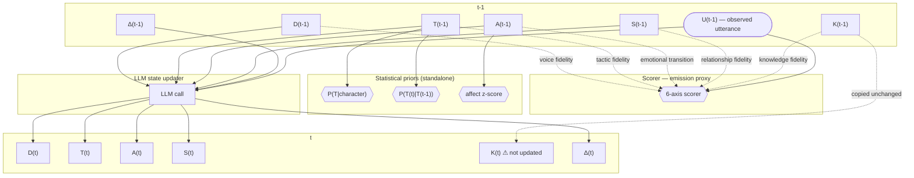
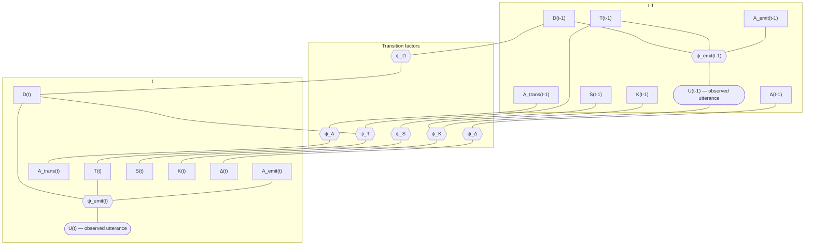

# Latent State Architecture

This document describes the current implementation of the Uta Acting System's latent state representation: how dramatic psychology is modeled in code, how the pipeline populates it, and where the current design has limitations.

---

## 1. Core Design Principle: Factored State

The system models character psychology as a **factored latent state** — not a single monolithic hidden variable, but independent dimensions that can change asynchronously. This mirrors how actors work: a character can shift tactics while maintaining the same want, or escalate emotionally while keeping the same relationship stance.

The atomic unit is the **BeatState** (`schemas.py:75`): one character's full psychological snapshot at one beat.

---

## 2. Schema Hierarchy

All schemas are defined in `schemas.py`. The structural hierarchy:

```
Play
  ├── Act[]
  │     └── Scene[]
  │           ├── beats: Beat[]
  │           │     ├── utterances: Utterance[]
  │           │     ├── beat_states: BeatState[]   (one per character present)
  │           │     ├── beat_summary: str
  │           │     └── characters_present: str[]
  │           └── bible: SceneBible (optional)
  │
  ├── characters: str[]
  ├── character_bibles: CharacterBible[]
  ├── scene_bibles: SceneBible[]
  ├── world_bible: WorldBible
  └── relationship_edges: RelationshipEdge[]
```

### Utterance

The atomic dialogue unit. Fields: `speaker`, `text`, `stage_direction` (optional), `addressee` (optional). Identified by `play_id`, `act`, `scene`, `index`.

### Beat

A unit of consistent dramatic action, defined by Stanislavski/Meisner theory: a beat ends when a character's objective or tactic shifts, significant new information enters, or the emotional register sharply changes.

Parsers produce one provisional beat per scene. The segmenter (`analysis/segmenter.py`) refines these into real beats via LLM annotation, cached to `data/beats/{play_id}_beats.json`.

---

## 3. The BeatState: Factored Latent Dimensions

`BeatState` (`schemas.py:75-106`) has nine factored dimensions plus confidence/ambiguity fields:

### Symbolic dimensions (free-text strings)

| Field | What it captures | Example |
|---|---|---|
| `desire_state` | What the character wants right now (scene want) | "Convince Ranyevskaya to accept the dacha plan" |
| `superobjective_reminder` | How the scene want connects to the deepest, play-long want | "This is his chance to transcend his serf origins" |
| `obstacle` | What blocks the objective | "Her sentimental attachment to the estate" |
| `tactic_state` | Action verb — what the character is doing TO the other person | "persuade", "deflect", "mock", "plead" |
| `defense_state` | Active psychological defense mechanism | "intellectualization" |
| `psychological_contradiction` | Active internal conflict | "Wants to save her while also wanting to own what she owns" |

### Continuous sub-models

**AffectState** (`schemas.py:39-50`) — emotion as a 5D vector, extending Russell's circumplex:

| Dimension | Range | Anchors |
|---|---|---|
| `valence` | [-1, 1] | negative ↔ positive |
| `arousal` | [-1, 1] | calm ↔ activated |
| `certainty` | [-1, 1] | uncertain ↔ certain |
| `control` | [-1, 1] | powerless ↔ dominant |
| `vulnerability` | [0, 1] | guarded ↔ exposed |

Eigendecomposition of the affect transition covariance shows these 5 correlated dimensions reduce to 3 independent axes capturing 91.6% of beat-to-beat transition variance (condition number improves 4x). The three axes are: **Disempowerment** (certainty + control + valence, 59.9%), **Blissful Ignorance** (valence vs certainty, 21.7%), and **Burdened Power** (control vs valence, 10.0%). Arousal (5.9%) is near-IID (lag-1 autocorrelation +0.036) and functions as a stylistic modulator predicting utterance features rather than a transition variable. Vulnerability (2.5%) is invisible to text. The pipeline extracts all 5 raw dimensions; the factor graph (§9) operates on the rotated 3+1 architecture: 3 transition axes + arousal for emission. See EXPERIMENT_LOG.md for full eigenvalue analysis, eigenvector loadings, and per-PC text signatures.

Each has a `rationale: str` explaining the rating.

**SocialState** (`schemas.py:53-58`) — relational stance toward the addressee:

| Dimension | Range | Anchors |
|---|---|---|
| `status` | [-1, 1] | low status claim ↔ high status claim |
| `warmth` | [-1, 1] | hostile ↔ warm |

**EpistemicState** (`schemas.py:61-68`) — what the character knows, hides, and misunderstands:

| Field | Type | Purpose |
|---|---|---|
| `known_facts` | `list[str]` | Facts the character knows at this beat |
| `hidden_secrets` | `list[str]` | Facts the character is actively concealing |
| `false_beliefs` | `list[str]` | Things the character believes that are wrong |

### Confidence and ambiguity

| Field | Type | Purpose |
|---|---|---|
| `confidence` | `float` [0, 1] | How certain the interpretation is |
| `alternative_hypothesis` | `str` | An alternative reading if ambiguous |

These exist to preserve interpretive ambiguity — good dramatic analysis admits multiple readings. In practice, the extractor sets `confidence` and `alternative_hypothesis` is often empty.

---

## 4. Bible Models: Aggregated Character Knowledge

Bibles are synthesis outputs — they aggregate beat-level states into durable character knowledge used at inference time.

### CharacterBible (`schemas.py:148-177`)

Built by `analysis/bible_builder.py` from all BeatStates for a character.

**Enduring psychology:**
- `superobjective` — the character's deepest, play-long want
- `wounds_fears_needs` — psychological wounds, fears, and unmet needs
- `recurring_tactics` — action verbs the character uses repeatedly
- `preferred_defense_mechanisms`
- `psychological_contradictions`

**Voice:**
- `speech_style` — prose description of how they speak
- `lexical_signature` — characteristic words/phrases
- `rhetorical_patterns`
- `few_shot_lines` — up to 10 canonical lines sampled evenly across the play

**Knowledge:**
- `known_facts`, `secrets`

**Arc:**
- `arc_by_scene` — `dict[scene_id, str]`: brief note on what changes for this character in each scene

**Derived statistics:**
- `tactic_distribution` — `dict[str, int]`: tactic → count, computed directly from BeatState `tactic_state` values

### SceneBible (`schemas.py:129-136`)

Per-scene summary: `dramatic_pressure`, `what_changes`, `hidden_tensions`, `beat_map` (prose summary of beat progression).

### WorldBible (`schemas.py:139-145`)

Per-play: `era`, `genre`, `social_norms`, `factual_timeline`, `genre_constraints`.

**Caveat:** WorldBible is generated from LLM knowledge of the play title/author — it does not read the parsed text. For well-known plays this works; for obscure plays it would need to be text-grounded.

### RelationshipEdge (`schemas.py:180-188`)

Tracks pairwise character dynamics: `temperature_by_beat` (warmth float per beat), `power_by_beat` (A's power over B per beat), and a `summary`.

**Status (updated):** RelationshipEdges are now populated by `analysis/relationship_builder.py`, integrated into `run_analysis.py` as Step 4b. Current counts: Cherry Orchard 68, Hamlet 66, Earnest 30 (164 total). Relational profiles saved to `data/vocab/`.

---

## 5. Pass 1: How Latent States Are Populated

The pipeline (`scripts/run_analysis.py`) runs five steps:

### Step 1: Parse (`ingest/`)

- **Gutenberg** (`gutenberg_parser.py`): Regex-based parsing of Constance Garnett formatting (`SPEAKER. dialogue`). Handles multi-play files via `text_anchor`. Produces one provisional beat per scene.
- **TEI-XML** (`tei_parser.py`): Parses `<sp>`, `<speaker>`, `<stage>`, `<div type="act|scene">` with namespace handling. Also one beat per scene initially.

Both parsers extract `Utterance` objects and build the `Play → Act → Scene → Beat` hierarchy. Stage directions are captured when available. Addressee estimation is not implemented — `addressee` is always `None`.

### Step 2: Segment beats (`analysis/segmenter.py`)

An LLM (Opus) reads each scene's utterances and returns a JSON array of beat boundary indices. The system prompt defines beats in Stanislavski/Meisner terms. Results are cached to `data/beats/` and reused on subsequent runs.

Scenes with fewer than 3 utterances are not segmented.

### Step 3: Extract BeatStates (`analysis/extractor.py`)

For each beat, the LLM receives:
- Play title, act, scene, beat index
- Prior context (summaries of last 3 beats in the scene)
- The beat's utterances
- Characters present

It returns structured JSON with all BeatState fields for each character. The code parses the JSON, constructs `AffectState`, `SocialState`, `EpistemicState` sub-models, and attaches the resulting `BeatState` objects to the beat.

**Error handling:** If JSON parsing fails, the code tries a regex fallback to extract a JSON object. If that fails, the beat gets no BeatStates. Individual characters that fail to parse are silently skipped.

### Step 4: Smooth arcs (`analysis/smoother.py`)

For each character, the LLM reads their full BeatState trajectory across the play and returns a JSON array of corrections. Each correction specifies `beat_id`, `field`, `old_value`, `new_value`, `rationale`. Corrections are applied via `setattr`. Runs `SMOOTH_PASSES` times (default: 2).

The smoother looks for: unmotivated tactic jumps, knowledge inconsistencies, abrupt emotional transitions, superobjective drift, missing contradictions.

### Step 4b: Build relationship edges (`analysis/relationship_builder.py`)

For each pair of characters co-occurring in ≥3 beats, aggregates `social_state` (warmth, status) across all shared beats to produce directed `RelationshipEdge` objects and `RelationalProfile` summaries. Zero API cost — pure computation over existing BeatStates. Now integrated into the pipeline between smoothing and bible building.

### Step 5: Build bibles (`analysis/bible_builder.py`)

- **CharacterBible**: LLM reads the character's beat-by-beat arc + sample canonical lines → synthesizes the bible fields. `tactic_distribution` is counted directly from `BeatState.tactic_state`. `few_shot_lines` are sampled from actual utterances (up to 10, evenly distributed).
- **SceneBible**: LLM reads scene utterances + beat states → synthesizes the four scene bible fields.
- **WorldBible**: LLM is given only play title + author → relies on its training knowledge.

Output: Complete `Play` object saved to `data/parsed/{play_id}.json` and `data/bibles/{play_id}_bibles.json`.

---

## 6. Pass 2: How Latent States Drive Improvisation

The improv system (`improv/`) uses the bible + scene context to generate lines controlled by a live BeatState that evolves turn-by-turn.

### State initialization (`improvisation_loop.py:87-162`)

Given a `CharacterBible` and `SceneContext`, the LLM infers an initial `BeatState`: what the character would want, which tactic they'd default to, initial affect/social state. The epistemic state falls back to the bible's `known_facts` and `secrets` if the LLM doesn't specify them.

Continuous values are clamped to their valid ranges via a `_clamp` helper.

### Line generation (`improvisation_loop.py:221-276`)

The LLM receives a structured control prompt containing all nine BeatState dimensions, the character's speech style, up to 6 few-shot canonical lines, and the scene context. It returns a `CandidateLine` with `text` and `internal_reasoning`.

**What the generation prompt includes from the BeatState:**
- `desire_state`, `obstacle`, `tactic_state`, `superobjective_reminder`
- `affect_state.valence`, `affect_state.arousal`, `affect_state.vulnerability`
- `social_state.status`, `social_state.warmth`
- `defense_state`, `psychological_contradiction`
- `epistemic_state.hidden_secrets` (up to 3)

**What it omits:** `affect_state.certainty`, `affect_state.control`, `epistemic_state.known_facts`, `epistemic_state.false_beliefs`, `confidence`, `alternative_hypothesis`. The omission of certainty and control is justified: their primary signal is captured by the Disempowerment axis (PC1, 59.9% of variance), which loads heavily on both. Providing the 3 rotated PC scores (Disempowerment, Blissful Ignorance, Burdened Power) instead of raw affect values gives the generation LLM more interpretable, less redundant control signals.

### Six-axis scoring (`improv/scorer.py`)

A critic LLM scores the candidate on:

| Axis | What it checks |
|---|---|
| `voice_fidelity` | Does this sound like the character? |
| `tactic_fidelity` | Does the action verb match the specified tactic? |
| `knowledge_fidelity` | Does the character reveal only what they should know? |
| `relationship_fidelity` | Is status/warmth appropriate? |
| `subtext_richness` | Is something happening beneath the words? |
| `emotional_transition_plausibility` | Is the affect shift motivated? |

Each axis is rated 1-5. Feedback is targeted and state-based (e.g., "This line is too direct; the tactic should be 'deflect'").

### Revision loop (`improvisation_loop.py:283-332`)

If `mean_score < SCORE_THRESHOLD` (3.0), the feedback is injected into the generation prompt and the line is regenerated. Up to `MAX_REVISION_ROUNDS` (3) retries. After the final round, the line is accepted regardless of score.

### State update (`improv/state_updater.py`)

After each turn, a critic LLM reads the previous BeatState + the line delivered + partner response and returns an updated state. Changes are incremental. The updater also reports `beat_shifted` (boolean) and `beat_shift_reason`, though these are not currently used to alter the flow.

**What the state updater receives from the previous state:** `desire_state`, `tactic_state`, affect (valence, arousal, vulnerability only), social (status, warmth), `defense_state`.

**What it omits:** `obstacle`, `superobjective_reminder`, `epistemic_state`, `confidence`, `alternative_hypothesis`, `affect_state.certainty`, `affect_state.control`.

### Architectural decision: desire subsumes character identity for tactic prediction

The tactic transition factor (ψ_T in §9.2) is parameterized as P(tactic_t | tactic_{t-1}, desire_similarity, desire_type) **without a character-specific term**. Desire embedding alone achieves 18.2% tactic prediction accuracy; adding character identity yields 18.3% — statistically indistinguishable. The LLM-generated desire string already encodes the behaviorally relevant aspects of character identity: a desire like "to force Ophelia to reveal whether she has been honest with him" implicitly carries Hamlet's suspicion, need for truth, and position of power.

This eliminates the need for per-character transition matrices (which would be sparse across 36+ characters) and enables the model to generalize to new characters without character-specific priors. Character-specific behavior emerges naturally because the LLM generates character-specific desires. Desire similarity between consecutive beats continuously modulates tactic persistence: persistence nearly doubles from 8.1% (low similarity) to 15.8% (high similarity).

**Scope of this decision:** Character identity remains load-bearing for voice/style (CharacterBible), relational dynamics (RelationshipEdge), arc tracking (ψ_arc), and epistemic state. The decision applies only to ψ_T — the tactic transition factor.

**Implications for Pass 2:** Generation prompts continue to use the full CharacterBible for voice/style, but the statistical feedback system relies on desire content rather than character identity for tactic deviation analysis. The `character_tactic_prior` in `StatisticalPrior` (P(tactic | character)) is less informative than the desire-conditioned prior used in the factor graph. Tactic shift feedback is graduated: a shift is more expected when the desire also shifted.

---

## 7. Evaluation: Three-Tier Comparison

`evaluation/judge.py` implements the three-tier protocol:

| Tier | What the LLM receives | Implementation |
|---|---|---|
| **Vanilla** | Zero-shot prompt: "You are [CHARACTER]." + scene context | `generate_vanilla()` |
| **Bible** | CharacterBible as system prompt + scene context | `generate_with_bible()` |
| **Reflection** | Full BeatState initialization + improv loop with scoring/revision | `generate_with_reflection()` — delegates to `run_turn()` |

A judge LLM (Opus) rates each generated line on 7 dimensions (recognizability, playability, tactic_fidelity, subtext, earned_affect, knowledge_fidelity_pass/note, identified_tactic). Each judge prompt runs `num_runs` times (default: 3) with `temperature=0.3` and scores are averaged.

**Current state:** Only Lopakhin evaluation scenes are hardcoded in `scripts/run_evaluation.py` (3 scenes). The PLAN calls for 20 scenes per condition x 3 conditions x 3 familiarity levels. The low-familiarity (Lomov) and synthetic character conditions are not yet implemented.

---

## 8. Data Flow Summary

```
Raw text/XML
    │
    ▼
[Parser] ──→ Play with provisional beats (1 per scene)
    │
    ▼
[Segmenter] ──→ Refined beats (cached to data/beats/)
    │
    ▼
[Extractor] ──→ BeatState[] per beat (all 9 dimensions)
    │
    ▼
[Smoother] ──→ Corrected BeatStates (arc-level coherence)
    │
    ▼
[Relationship Builder] ──→ RelationshipEdge[], RelationalProfile[]
    │
    ▼
[Bible Builder] ──→ CharacterBible, SceneBible, WorldBible
    │
    ▼
[Full Play JSON] ──→ data/parsed/{play_id}.json
                      data/bibles/{play_id}_bibles.json

Pass 1.5 (optional, via scripts/run_smoothing.py):

[Full Play JSON] + [Tactic Vocabulary] + [Learned Factors]
    │
    ▼
[Factor Graph Smoother] ──→ Smoothed posteriors (data/smoothed/)
    (forward-backward over T×D discrete states,
     Kalman updates for affect/social)

At inference time:

CharacterBible + SceneContext
    │
    ▼
[State Initializer] ──→ Initial BeatState
    │
    ▼
[Generator] ──→ CandidateLine (controlled by BeatState)
    │
    ▼
[Scorer] ──→ ScoredLine (6 axes + feedback)
    │
    ├── if below threshold ──→ back to Generator with feedback
    │
    ▼
[State Updater] ──→ Updated BeatState for next turn
```

---

## 9. Roadmap: From Symbolic States to Probabilistic Inference

The system has two inference modes. **Pass 1** (Phase A) produces point-estimate BeatStates via single LLM calls. **Pass 1.5** (Phase B) runs a factor graph smoother over those estimates to produce posterior distributions. This section describes both architectures and the remaining gaps.

### 9.1 Pass 1 architecture: LLM point estimates

Pass 1 produces point-estimate BeatStates via single LLM calls. The statistical components operate as standalone modules. The diagram below shows the Pass 1 dependencies.



**Status of factor graph components (Pass 1 vs Pass 1.5):**

| Component | Pass 1 | Pass 1.5 (factor graph) |
|---|---|---|
| Transition model | Single LLM call updates D, T, A, S, Δ jointly | Factored: ψ_T (semantic Dirichlet), ψ_A (diagonal Gaussian in eigenspace), ψ_S (Gaussian) |
| ψ_T dependencies | P(T(t)\|T(t-1)) bigram only | ψ_T(T(t-1), T(t), D(t)) with desire similarity conditioning (r=+0.106) |
| Epistemic transitions | K(t) is never updated; carried forward unchanged | Still not modeled — remains a gap |
| Emission model | 6-axis scorer returns ordinal scores (1–5) | Confusion model (P(observed\|true)=0.7); weak overall (R²<0.07); hard constraints for specific tactics |
| Cross-character coupling | Characters updated independently | ψ_social validated (r=-0.20); per-character graphs run independently in v1 |
| Inference | Point estimates from LLM | Forward-backward smoother with Kalman-style Gaussian updates |

### 9.2 Factor graph over the factored state

The factored BeatState design was chosen specifically to enable this migration. Each dimension becomes a variable node in a factor graph. The key insight is that these dimensions are **conditionally independent given certain shared contexts**, but not marginally independent — which is exactly the structure a factor graph can exploit.

For a single character `c` at beat `t`, the factored state is:

```
Z_c(t) = { D(t), T(t), A_trans(t), A_emit(t), S(t), K(t), Δ(t) }

where:
  D(t)       = desire / objective       (discrete: finite vocabulary of wants)
  T(t)       = tactic                   (discrete: finite vocabulary of action verbs)
  A_trans(t) = transition affect        (continuous: 3D vector in rotated eigenspace)
                 PC1: Disempowerment    (certainty + control + valence, 59.9% of variance)
                 PC2: Blissful Ignorance (valence vs certainty, 21.7%)
                 PC3: Burdened Power     (control vs valence, 10.0%)
  A_emit(t)  = emissive affect          (continuous: scalar)
                 Arousal                (near-IID, lag-1 r=+0.036; predicts utterance
                                         features but has no transition dynamics)
  S(t)       = social state             (continuous: 2D vector in [-1,1]^2)
  K(t)       = epistemic state          (structured: sets of propositions)
  Δ(t)       = defense / contradiction  (discrete or structured) — not modeled in v1
```

The affect decomposition reflects the empirical finding that 91.6% of beat-to-beat affect transition variance is captured by 3 correlated axes (A_trans), while arousal (A_emit) fluctuates independently and predicts utterance style rather than dramatic movement. A_trans participates in transition factors (ψ_A); A_emit participates only in emission factors (ψ_emit). The pipeline continues to extract raw 5D affect vectors; the rotation to this basis is a modeling-time transformation.

The factor graph connects these through several types of factors:



**Key structural distinction**: `A_trans` (Disempowerment, Blissful Ignorance, Burdened Power) connects to the transition factor ψ_A — it evolves through transition dynamics and captures the dramatic movement between beats. `A_emit` (Arousal) connects only to the emission factor ψ_emit — it is estimated from utterance features at each beat independently (near-IID) and shapes how the character speaks without participating in the dramatic transition structure. Note that `A_emit` has **no transition factor** and **no edge to ψ_A** — each beat's arousal is a fresh observation, not a propagated state.

**Factor types:**

1. **Transition factors** ψ_D, ψ_T, ψ_A, ψ_S, ψ_K, ψ_Δ: encode how each dimension evolves between beats. These capture the acting-theory constraint that state changes should be motivated.
   - ψ_T(T(t-1), T(t), D(t)): tactic transitions are conditioned on desire similarity (r=+0.106, p=0.005) via two mechanisms: (a) a continuous desire-similarity scalar modulating self-transition probability, and (b) a discrete desire-type latent variable (k=7 clusters) biasing the full transition distribution. Implemented with semantic Dirichlet priors over 66 canonical tactic clusters. Character identity is excluded — it adds no predictive power beyond desire content (see §6).
   - ψ_A(A_trans(t-1), A_trans(t)): transition affect is modeled as a diagonal Gaussian transition kernel in the rotated 3D eigenspace (one step-size variance per axis: Disempowerment, Blissful Ignorance, Burdened Power). Affect evolves smoothly per beat unless a major event occurs. A_emit (arousal) does **not** participate in ψ_A — it is near-IID (lag-1 r=+0.036) and is estimated per-beat from utterance features via ψ_emit.
   - ψ_K(K(t-1), K(t), U(t-1)): epistemic state is monotonic for facts (you can't un-learn something you heard) with possible revelation events when secrets are exposed.

2. **Emission factors** ψ_emit: P(utterance | D, T, A_emit). The emission model is weak overall (R²<0.07 for all features), making inference transition-dominated rather than observation-dominated. ψ_emit connects to A_emit (arousal), not A_trans — arousal shapes how a character speaks (word count, sentence length, lexical diversity) while the transition affect axes shape what is dramatically happening. A_emit is the most text-recoverable axis (1.26x classification lift, top RF predictor for 6/9 utterance features) and is estimated directly from utterance features at each beat. Tactic-specific hard emission constraints are reliable: PROBE/INTERROGATE maps to high question density, COMMAND to high imperative density, SHAME to high second-person rate. Ensemble extraction for better emission calibration is deferred to a future phase.

3. **Cross-character factors**: connect states across characters present in the same beat.
   - ψ_social(S_c1(t), S_c2(t)): status is relational and partially zero-sum (Pearson r=-0.20, p<0.0001 across all three plays). The effect is moderate and consistent across genres (Cherry Orchard -0.21, Hamlet -0.22, Earnest -0.27). When c1 claims high status, c2's status claim is constrained but not fully determined.
   - ψ_epistemic(K_c1(t), K_c2(t), U(t)): if c1 reveals a secret in utterance U(t), c2's known_facts must update.
   - ψ_relationship(R(c1,c2,t)): the `RelationshipEdge` schema already models this — `temperature_by_beat` and `power_by_beat` become time-varying edge potentials.

4. **Global factors**: enforce play-level constraints.
   - ψ_arc(D(1), D(2), ..., D(T)): the superobjective provides 6.25% information gain for tactic prediction and captures non-redundant information (ARI=0.008 vs tactic clusters). Beat-level consistency is 0.516, so it is modeled as a soft, context-modulated prior rather than a fixed parameter.
   - ψ_genre(all states): genre constraints (comedy vs. tragedy) biasing transition priors. Out of scope for factor graph v1.

### 9.3 Multi-agent POMDP formulation

At inference time (Pass 2 / improvisation), the factor graph becomes a **multi-agent POMDP**. Each character is an agent with:

```
For character c:
  State:        Z_c(t) = { D(t), T(t), A(t), S(t), K(t), Δ(t) }
  Observation:  O_c(t) = partner's utterance + visible stage actions
  Action:       a_c(t) = (tactic choice, utterance) — what the character does/says
  Reward:       R(t) = alignment with superobjective + tactic effectiveness
  Transition:   Z_c(t+1) = f(Z_c(t), a_c(t), O_c(t))
  Belief:       b_c(t) = P(Z_partner | history of observations)
```

The POMDP framing captures what acting actually is:
- Each character has **private beliefs and objectives** (the epistemic state, the desire state)
- Each **observes imperfectly** — you see what the other person says and does, but not what they feel or want
- Each **chooses tactics** as actions designed to affect the other person's state
- Utterances are **actions that affect others' beliefs and relationships**
- The character must maintain a **belief distribution over the partner's hidden state** — "I think she's deflecting, but she might be genuinely indifferent"

The current system approximates this with point estimates and LLM-as-policy. The POMDP formulation would make the belief tracking explicit and allow for principled action selection (tactic choice) under uncertainty about the partner's state.

### 9.4 What the current schemas already support

The existing data structures were designed with this migration in mind:

| Current schema element | Role in probabilistic model |
|---|---|
| `BeatState` per character per beat | Becomes posterior marginal P(Z_c(t) \| observations 1:t) |
| `confidence` field | Seeds the posterior uncertainty; currently a scalar, would become per-dimension |
| `alternative_hypothesis` field | Second mode of a multimodal posterior |
| `tactic_distribution` in CharacterBible | Used as empirical prior P(tactic \| character) for factor graph initialization |
| `arc_by_scene` in CharacterBible | Constraints on the global factor ψ_arc |
| `RelationshipEdge.temperature_by_beat` | Used via ψ_social (r=-0.20 validated across 164 edges) |
| `EpistemicState.known_facts/hidden_secrets` | Structured belief state for the POMDP observation model |
| `AffectState` 5D vector | Rotated to 3+1 eigenspace: 3 transition axes (A_trans) for Gaussian transition kernels + arousal (A_emit) for emission |
| `ScoredLine` six-axis scores | Proxy for emission likelihood P(utterance \| state) on each dimension |

### 9.5 Migration path: what changes at each phase

**Phase A (Pass 1):** LLM produces point-estimate BeatStates. The smoother is an LLM review pass. No formal probabilistic structure.

**Phase B (3 plays):** Factor graph implemented and operational.

1. **Discretize tactics** — DONE. 66 canonical tactic clusters built from corpus-wide free-text labels (e.g., "deflect", "deflection", "avoid" all map to DEFLECT). 79% coverage of extracted tactic strings. Canonical vocabulary stored in `data/vocab/tactic_vocabulary.json`.
2. **Learn transition priors** — DONE. Semantic Dirichlet priors over tactic transitions, conditioned on desire similarity (r=+0.106) and desire type (k=7 clusters). Affect transition kernels learned as diagonal Gaussians in the rotated 3D eigenspace.
3. **Calibrate LLM outputs as likelihoods** — PARTIALLY DONE. The emission model is characterized (R²<0.07 overall; tactic-specific hard constraints identified) and a confusion model treats LLM extraction as noisy observation (P(observed | true) = 0.7). Ensemble extraction at multiple temperatures is deferred.
4. **Run belief propagation** — DONE. Forward-backward smoother implemented (`factor_graph/inference.py`), producing smoothed posterior distributions over tactic and desire states with Kalman-style Gaussian updates for affect and social dimensions. Runs via `scripts/run_smoothing.py`.
5. **Use posterior distributions** — DONE for Pass 1.5 (smoothed posteriors available for all characters with 3+ beats). Available for Pass 2 improvisation via the `--factor-graph` flag, which replaces point-estimate state updates with forward-filtered posteriors.

**Phase C (many plays):** Replace hand-designed factors with learned potentials. Train character-specific emission models. Learn latent embeddings with symbolic heads (Option C). The factor graph structure is preserved but the potentials are parameterized by neural networks.

### 9.6 What the factor graph addresses

The factor graph (Pass 1.5) addresses several Pass 1 limitations:

- **Limitation #1 (single-shot extraction):** Forward-backward inference aggregates evidence across beats, reconciling noisy LLM extractions with learned transition dynamics.
- **Limitation #2 (uncalibrated floats):** Transition priors learned from the corpus provide empirical grounding for affect and social dimensions via Gaussian kernels in the rotated eigenspace.
- **Limitation #3 (no temporal smoothing):** The forward-backward smoother is a principled replacement for the LLM review pass, with exact discrete inference over 462 joint states and Kalman-style continuous updates.
- **Limitation #4 (RelationshipEdges):** 164 edges populated; ψ_social validated (r=-0.20). Cross-character coupling in the factor graph is deferred (per-character graphs run independently in v1).
- **Limitation #15 (tactic taxonomy):** 66 canonical clusters with semantic Dirichlet smoothing, used throughout the factor graph.

---

## 10. Limitations and Caveats (Current Implementation)

### Latent state representation

1. **Pass 1 extraction is single-shot LLM inference.** Each BeatState is a point estimate from a single LLM call. The `confidence` and `alternative_hypothesis` fields exist in the schema but are underutilized — the LLM typically sets `confidence: 1.0` and leaves `alternative_hypothesis` empty. Pass 1.5 (forward-backward smoother) now provides smoothed posterior distributions that reconcile these noisy extractions with learned transition dynamics.

2. **Continuous dimensions are LLM-estimated with empirical grounding.** Affect and social state floats are produced by asking the LLM to output numbers. There is no anchoring protocol and no inter-annotator agreement baseline. However, eigendecomposition of the affect covariance provides empirical structure (3+1 architecture, 91.6% variance captured), and the factor graph's Gaussian transition kernels provide calibrated uncertainty over affect trajectories.

3. **LLM-based smoother replaced by forward-backward algorithm.** The original LLM review pass (`analysis/smoother.py`) remains available for Pass 1. Pass 1.5 uses a principled forward-backward smoother (`factor_graph/inference.py`) with Kalman-style Gaussian updates for continuous dimensions and exact discrete inference over the T x D state space (66 x 7 = 462 joint states).

4. **RelationshipEdges populated** — 164 edges across 3 plays (Cherry Orchard 68, Hamlet 66, Earnest 30). Built by `analysis/relationship_builder.py` as Step 4b.

5. **Addressee estimation is not implemented.** `Utterance.addressee` is always `None`. The system prompts do not leverage addressee information, and the `SocialState` (status/warmth "toward addressee") has no explicit addressee binding when multiple characters are present.

### Information loss in the pipeline

6. **Generation prompt omits several BeatState fields.** The generation prompt (`improvisation_loop.py:192-218`) sends `affect_state.valence`, `arousal`, and `vulnerability` but omits `certainty` and `control`. It omits `epistemic_state.known_facts` and `false_beliefs`. The state updater similarly operates on a subset of the full state. The eigenspace rotation addresses the certainty/control omission: the 3 rotated PC scores (Disempowerment, Blissful Ignorance, Burdened Power) capture 91.6% of transition variance from all 5 raw dimensions, including certainty and control. Providing rotated scores instead of raw values would reduce redundancy while preserving the information content.

7. **State updater does not update epistemic state.** After each improv turn, the updater adjusts desire, tactic, affect, social, and defense — but does not track changes to what the character knows, what secrets have been revealed, or what false beliefs have been corrected. Over a long improv session, the epistemic state drifts from reality.

8. **WorldBible is not text-grounded, and creates a contamination channel.** The WorldBible is generated from the LLM's knowledge of the play title and author, not from the parsed text. This works in two directions:
   - For **obscure plays**, the LLM lacks the knowledge to produce an accurate WorldBible, making the output unreliable.
   - For **well-known plays**, the WorldBible becomes a conduit for the contamination problem described in PLAN.md §3. The LLM already "knows" the world of Hamlet or Cherry Orchard from pretraining. When the WorldBible (era, social norms, genre constraints, factual timeline) is fed back into the generation and scoring prompts, it is unclear whether the system's structured state representation is doing the work, or whether the LLM is simply pattern-matching against memorized knowledge about these plays. This compresses the delta between tiers and makes it harder to attribute improvements to the system architecture rather than the LLM's prior familiarity with the material. The same concern applies to CharacterBible and BeatState extraction — the LLM's pretraining on canonical literary analysis may dominate its outputs for well-known characters, regardless of what the prompts specify. The low-familiarity and synthetic character conditions in the evaluation design exist precisely to control for this.

### Evaluation gaps

9. **Only 3 hardcoded evaluation scenes.** The PLAN calls for 20 scenes x 3 tiers x 3 familiarity levels. The current implementation has 3 Lopakhin scenes. There are no Hamlet evaluation scenes, no low-familiarity character (Lomov / The Proposal), and no synthetic character.

10. **No inter-rater reliability reporting.** The judge runs each prompt 3 times and averages, but does not report variance or compute agreement metrics. The PLAN specifies reporting variance and using 2 judge models as ensemble; neither is implemented.

11. **Evaluation uses the same model family for generation and judging.** Both generation and scoring/judging use Claude models. There is no cross-model evaluation to control for model-specific biases.

### Parsing limitations

12. **Gutenberg parser is format-specific.** It handles the Constance Garnett convention (`SPEAKER. dialogue`) but may fail on other Gutenberg formatting styles. The standalone-speaker-name fallback is a heuristic that can false-positive on all-caps headings.

13. **Stage directions are discarded during Gutenberg parsing.** The Gutenberg parser recognizes stage directions (`[brackets]` or `(parentheses)`) but drops them rather than attaching them to utterances. The TEI parser captures them.

### Structural issues

14. **Beat summary is not populated during extraction.** `Beat.beat_summary` exists but is never set by the extractor or segmenter. It remains empty for all beats. The prior-context formatting in the extractor falls back to showing the first utterance of each prior beat.

15. **Tactic taxonomy implemented; defense taxonomy still missing.** 66 canonical tactic clusters with 79% coverage are stored in `data/vocab/tactic_vocabulary.json` and used throughout the factor graph. Semantic smoothing handles unmapped variants. `defense_state` remains a free-text string with no controlled vocabulary or normalization.

16. **No `__init__.py` files.** The `ingest/`, `analysis/`, `improv/`, and `evaluation/` directories lack `__init__.py`. Imports work via `sys.path.insert(0, ...)` at the top of every file. This is fragile and prevents the project from being installed as a package.

---

## 11. Current State of Pipeline Outputs

All three plays have been fully processed:

| Play | Raw source | Beats cached | Full parse | Bibles |
|---|---|---|---|---|
| Cherry Orchard | `data/raw/cherry_orchard.txt` (419 KB) | Yes | Yes (1.9 MB) | Yes |
| Hamlet | `data/raw/hamlet.xml` (583 KB) | Yes | Yes (3.0 MB) | Yes |
| The Importance of Being Earnest | `data/raw/importance_of_being_earnest.txt` | Yes | Yes (1.1 MB) | Yes |

The parsed JSON files contain the complete `Play` objects with all BeatStates, CharacterBibles, SceneBibles, and WorldBibles. These are viewable through the Redwood SDK viewer app (`viewer/`).
